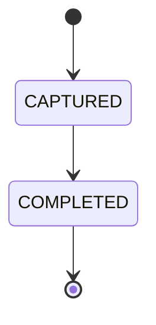

# Document Title

```yaml
document_id:
title:
status: draft
version: 0.1.0
owner:
reviewers: []
created_at: YYYY-MM-DD
updated_at: YYYY-MM-DD
parent_documents: []
dependent_documents: []
related_schemas: []
related_adrs: []
```

## 1. Purpose

この文書が可能にする判断、実装、検証を記載する。

## 2. Scope

### In scope

-

### Out of scope

-

## 3. Preconditions

-

## 4. Inputs

| Input | Source | Required | Validation | Classification |
|---|---|---:|---|---|
| | | | | |

## 5. Outputs

| Output | Consumer | Format | Acceptance criteria | Evidence |
|---|---|---|---|---|
| | | | | |

## 6. Actors, Responsibilities, and Authority

| Actor | Responsibility | Required authority | Prohibited action |
|---|---|---|---|
| | | | |

## 7. State Model or Procedure



## 8. Normal Flow

1.

## 9. Exception Flow

| Exception | Detection | Retry | Fallback | Escalation | Closure condition |
|---|---|---|---|---|---|
| | | | | | |

## 10. Controls

| Risk | Preventive control | Detective control | Corrective control | Evidence |
|---|---|---|---|---|
| | | | | |

## 11. Evidence and Retention

-

## 12. Acceptance Criteria

- [ ]

## 13. Tests

### Normal cases

-

### Failure cases

-

### Control tests

-

### Regression tests

-

## 14. Migration and Rollback

-

## 15. Open Questions

-
